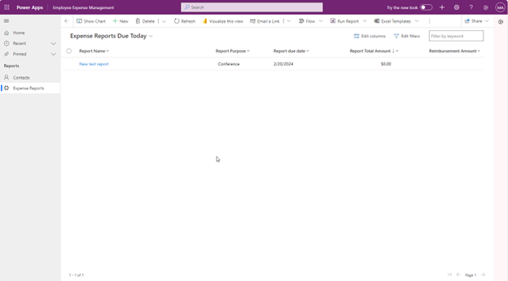

---
lab:
  title: 'Laboratorio 4.4: Compilación de una aplicación basada en modelo'
---

# Laboratorio 4.4: Compilación de una aplicación basada en modelo

## Escenario
Bellows College es una organización educativa con varios campus y programas.

Muchos de los instructores y administradores de Bellow Colleges necesitan asistir a eventos y comprar artículos. Históricamente, el seguimiento de estos gastos ha sido un problema.
La administración del campus desea modernizar su sistema de informes de gastos y así proporcionar a los empleados un método digital de notificar los gastos.

A lo largo de este curso, creará aplicaciones y realizará la automatización para que los empleados de Bellows College puedan administrar los gastos.

## Pasos de alto nivel del laboratorio
Como parte de la configuración de la aplicación basada en modelo, completarás lo siguiente:
- Configuración de la nueva aplicación basada en modelo denominada Administración de gastos de los empleados

Trabajaremos con los siguientes componentes:
- Vistas: Las vistas permiten al usuario mostrar los datos existentes en la tabla del formulario.
- Formularios: Aquí es donde el usuario crea/actualiza nuevas filas en las tablas.
Ambos se integrarán a la aplicación basada en modelo para una mejor experiencia de usuario.

## Requisitos previos
- Finalización del Módulo 1 Laboratorio 0: Validación del entorno de laboratorio

## Ejercicio 1: Crear una aplicación basada en modelo
**Objetivo:** En este ejercicio, usarás la aplicación basada en modelo que has configurado en el Laboratorio 4.3. Después personalizarás el mapa del sitio y probarás la aplicación.
Por motivos de simplicidad y tiempo, no abordaremos algunas de las columnas de Informe de gastos de este laboratorio.

## Tarea 1: Configurar el mapa del sitio
1. Si aún no lo estás, inicia sesión en `https://make.powerapps.com`.
2. Selecciona el entorno al que has importado la solución Informe de gastos en la parte superior derecha si aún no está seleccionada.
3. En el panel de navegación de la izquierda, selecciona **Soluciones.**
4. Abre la solución Informe de gastos.
5. Busca la aplicación *`Employee Expense Management`* que has creado en el último ejercicio.
6. Selecciona **Editar** para abrir el diseñador de aplicaciones moderno.
7. Selecciona **Nueva página** en la barra de comandos.
8. Se abrirá la pantalla **Nueva página**.
9. Elige **Tabla de Dataverse.**
10. Seleccione las tablas siguientes:
    - Informe de gastos
    - Línea de gastos
11. Asegúrate de que Mostrar en navegación está seleccionado.
12. Después de seleccionar las 2 tablas, selecciona **Agregar.**
13. Con los iconos de navegación del panel izquierdo de la pantalla, seleccione **Navegación**.
14. En el panel de navegación, seleccione **Nuevo grupo** a continuación, donde dice Navegación. Es posible que tenga que expandir el menú de la izquierda.
15. En la parte derecha de la pantalla, en la sección Opciones de visualización, cambia la propiedad Título a *`Expense Reports`*.
16. En la sección Navegación, selecciona los **puntos suspensivos (tres puntos)** junto a **Informes de gastos.** En el menú que aparece, selecciona **Subir**. Los informes de gastos ahora deberían aparecer encima de las líneas de gastos en la navegación.
17. En Navegación, selecciona el formulario **Informes de gastos**.
18. Ve a la sección En esta aplicación en el lado derecho de la pantalla.
19. Seleccione **Mostrar más**.
20. Selecciona los **puntos suspensivos** junto a Formulario de vista rápida de información.
21. En el menú que aparece, selecciona **Quitar.**
22. Selecciona los **puntos suspensivos** junto a Formulario de tarjeta de información.
23. En el menú que aparece, selecciona **Quitar.**
24. En Navegación, selecciona el formulario **Líneas de gastos**.
25. Ve a la sección En esta aplicación en el lado derecho de la pantalla.
26. Seleccione **Mostrar más**.
27. Selecciona los **puntos suspensivos** junto a Formulario de vista rápida de información.
28. En el menú que aparece, selecciona **Quitar.**
29. Selecciona los **puntos suspensivos** junto a Formulario de tarjeta de información.
30. En el menú que aparece, selecciona **Quitar.**
31. Seleccione **Guardar** y espere hasta que se guarden los cambios.
32. Una vez completado el guardado, selecciona el botón **Publicar** para publicar los cambios. Espere a que se complete la publicación.

### Tarea 2: Prueba de la aplicación
**Inicio de la aplicación**
1. Seleccione el botón Reproducir. La aplicación basada en modelo se cargará en una nueva pestaña.

**Creación de un informe de gastos**
1. Selecciona **Informes de gastos** en la navegación de la izquierda (también conocida como mapa del sitio).
2. Seleccione **+ Nuevo**.
3. Especifique los campos de la siguiente manera:
    - Nombre del informe: **`New Test Report`**
    - Propósito del informe: selecciona **`Conference`**
    - Fecha de vencimiento del informe: selecciona **`Today's date`**
4. Selecciona **Guardar y cerrar.** Esto creará el nuevo informe de prueba y debería poder verlo en la vista Informes de gastos activos.
5. Cambia la vista a **Informes de gastos que vencen hoy** con la lista desplegable situada junto a Informes de gastos activos.
6. Puede agregar más registros de prueba.

Su aplicación basada en modelo en ejecución debería tener este aspecto:

Felicidades. Ha creado y configurado la primera aplicación basada en modelo.
